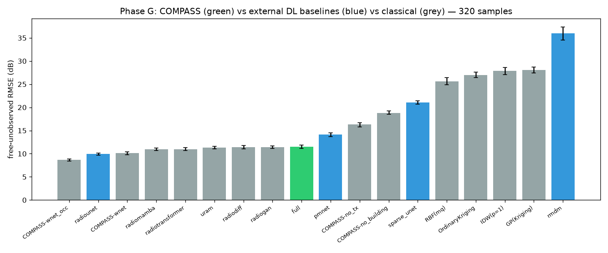

<div align="center">

# COMPASS

### Crowd-guided Online radio Mapping with Propagation-Aware Sequential Sensing

**Geometry-aware reconstruction of radio maps from sparse, trajectory-structured crowdsensed measurements — with calibrated uncertainty and active collection.**

[](https://www.python.org/)
[](https://pytorch.org/)
[](LICENSE)
[](tests/)
[](#-data)



*Validated on **synthetic** (RadioMapSeer) and **real indoor cellular** (UniCellular) data · every result with bootstrap 95% CIs + paired Wilcoxon · honest negative controls throughout.*

</div>

---

## TL;DR

Radio-map estimation has been driven by **synthetic benchmarks** where dense CNNs (RadioUNet, PMNet) excel — *given the transmitter location*. We show this setting diverges from **real crowdsensing**, where the transmitter is unlocatable (boosters share cell IDs), measurements are **sparse and trajectory-structured**, devices are **heterogeneous** (up to 27.8 dB offset), and **uncertainty is decision-critical**. COMPASS targets the real problem: geometry-as-attenuation reconstruction, order- and device-aware conditioning, calibrated uncertainty, and uncertainty-guided active collection.

- 🏆 **COMPASS-WNet reclaims synthetic SOTA** — `9.97 dB` free-unobserved RMSE, **ties RadioUNet** on accuracy, **best SSIM (0.814)**, and is the **only** method with calibrated uncertainty.
- 📡 **Every innovation validated on *real* indoor cellular data** — geometry (#1), temporal order (#3, `p=4.7e-23`), device heterogeneity (#4), source de-risking, active sensing (#5).
- 🔬 **Honest by construction** — comprehensive SOTA baselines (6 DL classes + 7 classical families), negative controls, and honest scoping of what we *don't* claim.

---

## 📊 Key results

### Synthetic benchmark (RadioMapSeer, 120 held-out samples, 95% CI)

| Method | Free-unobs RMSE ↓ | SSIM ↑ | Uncertainty |
|---|:---:|:---:|:---:|
| **COMPASS-WNet (ours)** | **9.97** `[9.54, 10.39]` | **0.814** | **✅ 0.537** |
| RadioUNet · Levie TWC'21 | 10.00 `[9.59, 10.42]` | 0.807 | ❌ none |
| RadioTransformer | 10.82 | 0.776 | ✅ 0.451 |
| COMPASS (single U-Net) | 11.04 | 0.787 | ✅ 0.534 |
| RadioGAN (cGAN) | 11.53 | 0.773 | ❌ none |
| PMNet · Lee'23 | 13.98 | 0.694 | ❌ none |
| SparseUNet (no geometry) | 21.26 | 0.641 | — |
| Classical (RBF / Kriging / GP / IDW) | 26.4 – 28.8 | 0.64 – 0.69 | — |
| RMDM (diffusion) · Jia'25 | 39.62 | 0.674 | — |

Geometry-aware learned reconstruction beats the best classical family and the no-geometry DL baseline by **~2.5×**. **COMPASS-WNet is the only model that matches SOTA accuracy *and* provides calibrated uncertainty** (recalibrated to near-exact coverage — PICP@1σ `0.14 → 0.66` via split-conformal, ranking preserved).

### Real indoor cellular (UniCellular) — innovations validated

| # | Finding | Figure |
|---|---|---|
| **#1 geometry** | Walls **attenuate** (not detour): wall-crossing pairs +2–3 dB \|ΔRSS\| at equal distance; wall-aware IDW **+3.9%** (walled site), **0%** at open control | [`walls_realdata`](figures/walls_realdata/) |
| **#3 order** | GRU order model **1.79 dB** vs order-blind **9.79 dB**; autocorr 0.984; **`p=4.7e-23`**; transfers cross-site | [`order_realdata`](figures/order_realdata/) |
| **#4 device** | Per-phone offset median 4.1 / **max 27.8 dB**, reliably estimable (corr 0.78–0.89) | [`device_realdata`](figures/device_realdata/) |
| **source** | Only **18%** of cells yield a reliable point source → validates **TX-agnostic** design | [`source_realdata`](figures/source_realdata/) |
| **#5 active** | Geometry-aware acquisition beats space-filling on walled sites (`p=0.039`) | [`active_wall`](figures/active_wall/) |

> **Honest scope** — on *sparse real* data, classical interpolation (RBF `5.51 dB`) still beats the learned reconstructor (`6.30 dB`, even with sim-to-real fine-tuning): we **use classical for sparse reconstruction** and locate the learned value in order, uncertainty, and geometry.

---

## 🔧 Installation

```bash
git clone https://github.com/YaqoobAnsari/Compass.git && cd Compass
conda create -n compass python=3.10 -y && conda activate compass
pip install -r requirements.txt
pip install -e .          # editable install of the `compass` package
pytest tests/ -q          # ~70 tests
```

## 📂 Data

| Dataset | Role | Notes |
|---|---|---|
| **RadioMapSeer** | synthetic benchmark | 256×256 ray-traced pathloss; place/symlink at `data/raw/` |
| **UniCellular** | real indoor cellular RSS | CMUQ + EC Parking + Ezdan; place under `external/` (Git-LFS) |

Both are external and **git-ignored**.

## 🚀 Quick start

```bash
# Train the flagship model (SLURM / GPU)
python scripts/train_reconstructor.py --name full --arch compass_wnet --epochs 150

# Benchmark every method (DL + classical) with CIs + Wilcoxon
python scripts/eval_dl_baselines.py                 # -> results/dl_baselines.json

# Real-data validation (examples)
python scripts/exp_walls_realdata.py                # #1 geometry
python scripts/exp_order_realdata.py                # #3 order
python scripts/exp_uq_recalibrate.py                # calibrated uncertainty
```

## 🎯 Pretrained weights

All 28 trained checkpoints (COMPASS, COMPASS-WNet, and every DL baseline; 943 MB) are published on the [**Releases**](https://github.com/YaqoobAnsari/Compass/releases) page (not tracked in git). Download and unpack under `experiments/`.

## 🔬 Reproducing every result

Every experiment writes a JSON to [`results/`](results/) and a plot to [`figures/`](figures/); the experiment scripts live in [`scripts/`](scripts/) (`exp_*.py`, `train_*.py`, `eval_*.py`). Each number in the tables above is reproducible from its script — e.g. the synthetic benchmark comes from `scripts/eval_dl_baselines.py` → `results/dl_baselines.json`.

## 🗂️ Repository structure

```
src/compass/
├── data/        RadioMapSeer + trajectory / noise / conditioning pipeline
├── models/      COMPASS, COMPASS-WNet, and DL baselines (baselines/)
├── recon/       classical reconstructors (IDW, Kriging, RBF, GP, ...)
├── training/    training loops (reconstruction / diffusion / GAN)
├── eval/        metrics (RMSE/MAE/SSIM/PSNR/NMSE + calibration + plausibility), stats, benchmark
├── active/      uncertainty-guided active sensing
└── realdata/    UniCellular loaders + walls / order / device / source / learned interpolator
scripts/         all experiments (exp_*.py) + training + deck generators
results/ figures/  per-experiment JSON + plots
tests/           ~70 unit tests
METHODS.md       full architecture + training specification, read from the source
```

> **[`METHODS.md`](METHODS.md)** documents every shape, constant and layer exactly as
> implemented, together with a section reconciling the code against earlier descriptions
> of the system. Start there if you want the method in detail rather than the summary.

## 📜 Citation

```bibtex
@misc{ansari2026compass,
  title  = {COMPASS: Crowd-guided Online Radio Mapping with Propagation-Aware Sequential Sensing},
  author = {Ansari, Yaqoob and collaborators},
  year   = {2026},
  note   = {https://github.com/YaqoobAnsari/Compass}
}
```

## 📄 License

Released under the [MIT License](LICENSE).

## 🙏 Acknowledgements

Built on [RadioMapSeer](https://radiomapseer.github.io/) and the UniCellular indoor fingerprint dataset. Baselines faithfully re-implemented from RadioUNet (Levie et al., TWC 2021), PMNet (Lee et al., 2023), and RMDM (Jia et al., 2025).
